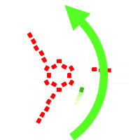

  <picture>
    <source media="(prefers-color-scheme: dark)" srcset="media/overpass-logo-dark.png" width="100">
    <source media="(prefers-color-scheme: light)" srcset="media/overpass-logo-light.png" width="100">
    
  </picture>

<h3 align="center">Overpass API</h3>

Necessary files to build and run the <a href="https://github.com/mmd-osm/Overpass-API/tree/test7591">performance optimized Overpass API image</a>

    
    

---
# Overpass API

The main purpose of this repository is to contain all the necessary files to build and run the [performance optimized Overpass API image](https://github.com/mmd-osm/Overpass-API/tree/test7591) created by [mmd](https://github.com/mmd-osm).

An example of the needed files was obtained from the [wiktorn/Overpass-API](https://github.com/wiktorn/Overpass-API) repository, but it was modified to be adapted to build and run the [mdd-osm/Overpass-API](https://github.com/mmd-osm/Overpass-API).

## How to build and run this image

### Build

To build the image just navigate to the root of this project and simply run `docker build -t <tag_name> .` (don't forget the `.` of the end), i.e.: `docker build -t lhbelfanti/overpass-api:1.0.0`

It will take a while, but after it's done, you are ready to run the image.

### Run

> After running the image the Overpass service is available in `http://localhost/api/interpreter`.

To run the image, in the `docker-compose.yml`, replace the `image` property by the image built, i.e.: `lhbelfanti/overpass-api:1.0.0`.

Then, configure the environment variables. And lastly run `docker-compose up`.

The following environment variables can be used to customize the setup (some of them were taken from the wiktorn image, others form the mmd-osm image, and others were custom-made for this repository):

**Database initialization variables:**
- `OVERPASS_PLANET_URL` - The url of a planet file. [There are many mirrors](https://wiki.openstreetmap.org/wiki/Planet.osm) where you can download them. (e.g. http://download.openstreetmap.fr/extracts/south-america/argentina-latest.osm.pbf)
- `OVERPASS_DIFF_URL` - The url to a diff directory for updating the instance (e.g. http://download.openstreetmap.fr/replication/south-america/argentina/minute/).
If this variable is not set, the database won't be updated anytime, nor even during the initialization of the Overpass service, nor after the initialization process is completed.
- `OVERPASS_UPDATES_ENABLED` - **⚠️ MANDATORY VARIABLE**: Set it to `1` if you want the database to be updated with the latest diffs. Set it to `0` if you don't want the database to be updated with the latest diffs.
- `OVERPASS_UPDATE_SLEEP` - Integer, the delay between updates (seconds).
- `OVERPASS_STOP_AFTER_INIT` - If `false` the container will keep running after init is completed. Otherwise container will be stopped after initialization process is complete. Default `true`.

**Queries variables:**
- `OVERPASS_RATE_LIMIT` - Set the maximum allowed number of concurrent accesses from a single IP address. It is `-1` by default, which means "no rate limit".
- `OVERPASS_SPACE` - Set the memory limit for the total of all running processes. It should be defined in bytes. By default `12ll*1024*1024*1024` ~ 12gb.
- `OVERPASS_TIME` - Set the time unit limit for the total of all running processes. It should be defined in bytes. By default `256*1024` ~ 256kb.
- `OVERPASS_MAX_TIMEOUT` - Set the maximum timeout for queries. Global override. The sentence `[timeout:...]` of a query. By default is 1000.
- `OVERPASS_MAX_ELEMENT_LIMIT` - Set the maximum size permitted for a query. Global override. The sentence `[maxsize:...]` of a query.

**FastCGI variables:**
- `OVERPASS_FCGI_MAX_REQUESTS` - Number of FastCGI requests before interpreter process is being terminated (when idle).
- `OVERPASS_FCGI_MAX_ELAPSED_TIME`: Maximum time after which FastCGI process is being terminated (when idle).
- `OVERPASS_MAX_SPACE_LIMIT` - Maximum size of a FastCGI process's virtual memory (address space), in bytes. Default value: 2^33 (=8 GiB); memory will be unlimited when the parameter value is set to 0.

**General variables:**
- `OVERPASS_REGEXP_ENGINE` - Default regexp engine to use if none is specified in Overpass QL settings. Possible values include: POSIX, ICU, PCRE and PCREJIT. PCREJIT is recommended for best performance.
- `OVERPASS_LOG_LEVEL` - Define transactions.log log level. Available levels: 0 (error), 1 (warn), 2 (info), 3 (debug, default value), 4 (trace).
- `OVERPASS_SHARED_NAME_SUFFIX` - Define /dev/shm/osm3s*... shared memory file suffix, allowing multiple parallel Overpass instances on one system.
- `OVERPASS_HEALTHCHECK` - Shell commands to execute to verify that image is healthy. `exit 1` in case of failures, `exit 0` when container is healthy. Default healthcheck queries overpass and verifies that there is response returned.

#### ⚠️ Disclaimers:
- This image is mainly created to work for countries. It was specifically tested with the Argentina's map, and it was never meant to be tested with the complete world map. Anyway, you can try using the world map.
- The image that is built from this repository, doesn't support the `clone` mode of Overpass. It means that each time the service is run in a new computer, the map, provided by parameter, is downloaded and the latest updates are applied to it.
- The image doesn't support downloading maps from a mirror that requires login.
- The compression mode of the Overpass database in this image, is set to `gz`.

---
## License
[GNU GPLv3](https://choosealicense.com/licenses/gpl-3.0/)
